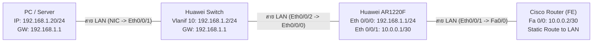

# คู่มือสรุปแผนภาพและ Configuration สำหรับ Network Automation Lab

เอกสารสรุปสถาปัตยกรรมเครือข่าย, แผนภาพการต่อสาย, ตารางกำหนด IP Address, คำสั่ง Configuration ของอุปกรณ์ทุกตัว, และขั้นตอนการทดสอบ SSH สำหรับโปรเจกต์ **Network Automation Platform (`deploy-config`)**

---

## 1. แผนภาพโครงสร้างเครือข่าย (Network Topology)

### 1.1 Mermaid Diagram


### 1.2 แผนภาพการเชื่อมต่อพอร์ตและ IP Address
```text
[ PC / Server ] 192.168.1.20/24 (Gateway: 192.168.1.1)
       │ (สาย LAN)
       ▼ พอร์ต Ethernet 0/0/1 (หรือ GE0/0/1)
[ Huawei Switch ] Management IP: 192.168.1.2/24 (Gateway: 192.168.1.1)
       │ พอร์ต Ethernet 0/0/2 (หรือ GE0/0/2)
       │ (สาย LAN)
       ▼ พอร์ต Ethernet 0/0/0 (FE0) : 192.168.1.1/24 (LAN Gateway)
[ Huawei Router AR1220F ]
       │ พอร์ต Ethernet 0/0/1 (FE1) : 10.0.0.1/30 (WAN Point-to-Point)
       │ (สาย LAN)
       ▼ พอร์ต FastEthernet 0/0 : 10.0.0.2/30 (WAN Point-to-Point)
[ Cisco Router ] (Static Route: 192.168.1.0/24 via 10.0.0.1)
```

---

## 2. ตารางสรุปการเชื่อมต่อและ IP Addressing (Port Matrix)

| อุปกรณ์ | พอร์ต | โหมดพอร์ต | IP Address / Mask | Gateway / Route | รายละเอียดการเชื่อมต่อ |
| :--- | :--- | :--- | :--- | :--- | :--- |
| **PC (Server)** | NIC | Host | `192.168.1.20/24` | `192.168.1.1` | เสียบเข้า Huawei Switch พอร์ต `Eth 0/0/1` |
| **Huawei Switch** | `Vlanif 10` | SVI | `192.168.1.2/24` | `192.168.1.1` | Management IP ของ Switch |
| | `Eth 0/0/1` | Access (VLAN 10) | - | - | ต่อหา PC (Server) |
| | `Eth 0/0/2` | Access (VLAN 10) | - | - | ต่อหา Huawei Router `Eth 0/0/0` |
| **Huawei AR1220F** | `Eth 0/0/0` (FE0) | Routed (undo portswitch) | `192.168.1.1/24` | - | ขา LAN Gateway ต่อกับ Switch |
| | `Eth 0/0/1` (FE1) | Routed (undo portswitch) | `10.0.0.1/30` | - | ขา WAN ต่อกับ Cisco Router `Fa 0/0` |
| **Cisco Router** | `Fa 0/0` | Routed | `10.0.0.2/30` | `192.168.1.0/24 via 10.0.0.1` | ขา WAN ต่อกับ Huawei Router `Eth 0/0/1` |

---

## 3. คำสั่ง Configuration ของอุปกรณ์แต่ละตัว

> **ข้อมูลเข้าสู่ระบบเริ่มต้น (Default Credentials):**  
> - **Username:** `admin`  
> - **Password:** `Admin@123456`

---

### 3.1 การตั้งค่าเครื่อง PC / Server (Linux)

```bash
# กำหนด Static IP และ Default Gateway
sudo ip addr add 192.168.1.20/24 dev eth0
sudo ip route add default via 192.168.1.1
```

---

### 3.2 Huawei Switch (Management IP: `192.168.1.2`)

```text
system-view
sysname SW-Huawei

# 1. สร้าง VLAN 10 และกำหนด Management IP
vlan 10
 quit
interface Vlanif 10
 ip address 192.168.1.2 255.255.255.0
 quit

# 2. ผูกพอร์ตเชื่อมต่อเข้า VLAN 10
interface Ethernet 0/0/1
 port link-type access
 port default vlan 10
 quit

interface Ethernet 0/0/2
 port link-type access
 port default vlan 10
 quit

# 3. ใส่ Default Gateway ชี้ไปหา Huawei Router
ip route-static 0.0.0.0 0.0.0.0 192.168.1.1

# 4. สร้าง RSA Key และเปิดบริการ Stelnet (SSH)
rsa local-key-pair create
2048
stelnet server enable

# 5. สร้าง User ในระบบ AAA
aaa
 local-user admin password cipher Admin@123456
 local-user admin privilege level 15
 local-user admin service-type ssh
 quit

ssh user admin authentication-type password
ssh user admin service-type stelnet

# 6. คอนฟิก VTY Lines ให้อนุญาตเฉพาะ SSH
user-interface vty 0 4
 authentication-mode aaa
 protocol inbound ssh
 quit

return
save
y
```

---

### 3.3 Huawei Router (AR1220F: LAN `192.168.1.1` / WAN `10.0.0.1`)

> **ข้อควรระวังสำหรับ AR1220F:**  
> พอร์ต `Ethernet 0/0/0` และ `Ethernet 0/0/1` ต้องใส่คำสั่ง `undo portswitch` เพื่อแปลงเป็น Layer 3 Routed Port ก่อนตั้ง IP Address

```text
system-view
sysname AR1220F-Huawei

# 1. คอนฟิก IP พอร์ตขา LAN (FE0 ต่อหา Switch)
interface Ethernet 0/0/0
 description LAN_to_Switch
 undo portswitch
 ip address 192.168.1.1 255.255.255.0
 undo shutdown
 quit

# 2. คอนฟิก IP พอร์ตขา WAN (FE1 ต่อหา Cisco Router)
interface Ethernet 0/0/1
 description WAN_to_Cisco
 undo portswitch
 ip address 10.0.0.1 255.255.255.252
 undo shutdown
 quit

# 3. สร้าง RSA Key และเปิด Stelnet (SSH)
rsa local-key-pair create
2048
stelnet server enable

# 4. สร้าง User ในระบบ AAA
aaa
 local-user admin password cipher Admin@123456
 local-user admin privilege level 15
 local-user admin service-type ssh
 quit

# 5. ผูกสิทธิ์ Authentication สำหรับ SSH
ssh user admin authentication-type password

# 6. คอนฟิก VTY Lines
user-interface vty 0 4
 authentication-mode aaa
 protocol inbound ssh
 quit

return
save
y
```

---

### 3.4 Cisco Router (พอร์ต FastEthernet: WAN `10.0.0.2`)

```text
enable
configure terminal
hostname R2-Cisco

# 1. ตั้ง Domain Name และสร้าง RSA Key สำหรับ SSH
ip domain-name lab.local
crypto key generate rsa
2048
ip ssh version 2

# 2. คอนฟิก IP พอร์ต FastEthernet 0/0
interface FastEthernet 0/0
 description WAN_to_Huawei
 ip address 10.0.0.2 255.255.255.252
 no shutdown
 exit

# 3. ***สำคัญที่สุด*** ใส่ Static Route ขากลับไปยังวง LAN PC/Server
ip route 192.168.1.0 255.255.255.0 10.0.0.1

# 4. สร้าง Admin User (Privilege Level 15)
username admin privilege 15 secret Admin@123456
enable secret Admin@123456

# 5. เปิดรับเฉพาะ SSH บน Line VTY
line vty 0 4
 login local
 transport input ssh
 exit

end
write memory
```

---

## 4. ขั้นตอนการทดสอบการเชื่อมต่อ (Verification Steps)

### ขั้นตอนที่ 1: ตรวจสอบความถูกต้องของเส้นทางด้วย Ping จาก PC/Server

```bash
ping -c 3 192.168.1.2    # 1. ทดสอบไปหา Huawei Switch
ping -c 3 192.168.1.1    # 2. ทดสอบไปหา Huawei Router (LAN Gateway)
ping -c 3 10.0.0.1        # 3. ทดสอบไปหา Huawei Router (WAN Interface)
ping -c 3 10.0.0.2        # 4. ทดสอบไปหา Cisco Router (ข้าม Router สำเร็จ)
```

---

### ขั้นตอนที่ 2: ทดสอบ SSH ผ่าน Command Line (CLI)

```bash
# ล็อกอินเข้า Huawei Switch
ssh admin@192.168.1.2

# ล็อกอินเข้า Huawei AR1220F
ssh admin@192.168.1.1

# ล็อกอินเข้า Cisco Router
ssh admin@10.0.0.2
```

---

### ขั้นตอนที่ 3: ทดสอบผ่าน Web Platform (`http://localhost:4000`)

| อุปกรณ์ | Device Type บนเว็บ | Host (IP) | Port | Username | Password |
| :--- | :--- | :--- | :---: | :--- | :--- |
| **Huawei Switch** | `huawei` | `192.168.1.2` | `22` | `admin` | `Admin@123456` |
| **Huawei AR1220F** | `huawei` | `192.168.1.1` | `22` | `admin` | `Admin@123456` |
| **Cisco Router** | `cisco_ios` | `10.0.0.2` | `22` | `admin` | `Admin@123456` |

---

## 5. การแก้ไขปัญหาที่พบบ่อย (Troubleshooting Tips)

1. **Ping Cisco Router (`10.0.0.2`) ไม่เจอ (Timeout)**:
   - ตรวจสอบคำสั่ง Static Route บน Cisco Router: `show ip route` (ต้องมีเส้นทาง `192.168.1.0/24 via 10.0.0.1`)
2. **Huawei AR1220F ฟ้อง `Error: Unrecognized command` ตอนใส่ IP**:
   - พอร์ตยังเป็น Layer 2 ให้พิมพ์คำสั่ง `undo portswitch` ภายใน interface ก่อน
3. **Huawei แจ้งเตือน `Error: Unrecognized command` ตอนใส่ `ssh user ... ser?`**:
   - บน AR1220F กำหนด service ในโหมด `aaa` (`local-user admin service-type ssh`) แล้ว และใน `system-view` ใช้เพียง `ssh user admin authentication-type password`
