# NetAuto Hub — Network Automation & Diagnostic Web Platform

[](https://www.python.org/)
[](https://fastapi.tiangolo.com/)
[](https://react.dev/)
[](https://vitejs.dev/)
[](https://tailwindcss.com/)
[](https://github.com/ktbyers/netmiko)
[](https://nornir.readthedocs.io/)
[](https://www.docker.com/)

**เว็บแอปสำหรับทีม Network/NOC ที่ไล่หาอุปกรณ์ด้วย LLDP แล้วสร้างแผนผังเครือข่ายจริงให้อัตโนมัติ พร้อม Topology Editor สำหรับแก้ต่อเป็นเอกสาร — และมี Health Check, Troubleshoot, Deploy Config บน Switch / Router หลายยี่ห้อ ผ่าน SSH/Telnet พร้อมกันได้หลักหมื่นเครื่อง**

ปัญหาที่แก้: แทนที่จะต้อง SSH เข้าไปทีละเครื่อง พิมพ์คำสั่งคนละแบบตามยี่ห้อ แล้วมานั่งรวม Log / วาด Topology เองใน Visio ระบบนี้รับรายชื่ออุปกรณ์ (หรือ Subnet) รันคำสั่งขนานกันด้วย Nornir แปลคำสั่งข้ามยี่ห้อให้ เก็บผลเป็นรายงาน ZIP / Excel และ**วาดแผนผังเครือข่ายจริงจาก LLDP** ที่แก้ต่อได้ในเว็บ แล้ว export เป็น SVG / PNG / draw.io

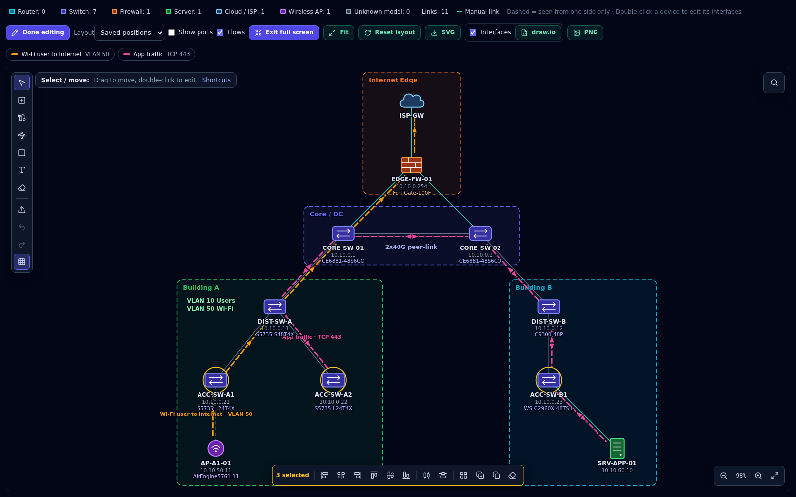

### จุดเด่น: จาก LLDP สู่แผนผังเครือข่ายที่ใช้เป็นเอกสารได้

| | |
| :--- | :--- |
| **สร้างผังได้ 4 ทาง** | สแกน LLDP จาก seed / subnet, import ตาราง LLDP จาก Excel / CSV, เปิดไฟล์ draw.io / SVG / PNG / JSON ที่เคย export ไว้ หรือวาดเองจากผังเปล่า |
| **ค้นหาเองแบบ recursive** | SSH ต่อไปยังเพื่อนบ้านจาก LLDP management IP ไม่ SSH ซ้ำตัวที่อยู่ใน Fleet หรือเคยเข้าแล้ว และลอง login ตามลำดับ Command Profile (Huawei → Cisco) เมื่อยังไม่รู้ยี่ห้อ |
| **Topology Editor เต็มรูปแบบ** | เพิ่มอุปกรณ์, ลาก Connect พร้อมเลือก interface, วาด Traffic flow, Zone, Note, เลือกหลายตัว, จัดแนว/กระจายระยะ, เส้นไกด์ตอนลาก, ค้นหา, ทำสำเนา, ซูม, โหมดเต็มจอ, Undo/Redo |
| **ไอคอนตามรุ่นอุปกรณ์** | อ่านรุ่นจาก `display/show version` และ LLDP แล้วเลือกไอคอน (router, switch, firewall, wireless …) รุ่นที่ระบบไม่รู้จัก **สอนได้เองจากหน้าเว็บ** (Model Rules) ไม่ต้องแก้โค้ด |
| **Round-trip ไม่เสียงาน** | ไฟล์ SVG / PNG / draw.io ที่ export ฝังข้อมูลผังไว้ เปิดกลับมาแก้ต่อได้ครบทั้งตำแหน่ง, flow, zone, note |

> ลองเล่นได้ทันทีโดยไม่ต้องมีอุปกรณ์จริง: หน้า **LLDP Discovery → Import Topology** แล้วเลือก [`docs/samples/campus_topology.json`](docs/samples/campus_topology.json) (ผัง campus ตัวอย่างในภาพด้านบน)

---

## สารบัญ

1. [Architecture & Network Topology](#1-architecture--network-topology)
2. [Key Features](#2-key-features)
3. [Tech Stack](#3-tech-stack)
4. [Getting Started](#4-getting-started)
5. [Usage — วิธีใช้งานแต่ละหน้า](#5-usage--วิธีใช้งานแต่ละหน้า)
6. [Demo / Output](#6-demo--output)
7. [Project Structure](#7-project-structure)
8. [REST API Reference](#8-rest-api-reference)
9. [Configuration (.env)](#9-configuration-env)
10. [Supported Vendors & Command Matrix](#10-supported-vendors--command-matrix)
11. [Inventory Import Formats](#11-inventory-import-formats)
12. [เตรียมอุปกรณ์จริงให้พร้อมใช้งาน](#12-เตรียมอุปกรณ์จริงให้พร้อมใช้งาน)
13. [Testing & Mock Data](#13-testing--mock-data)
14. [Performance Tuning](#14-performance-tuning)
15. [Security Notes](#15-security-notes)
16. [Troubleshooting & FAQ](#16-troubleshooting--faq)

---

## 1. Architecture & Network Topology

### 1.1 System Architecture

ระบบแยกเป็น 2 container: **Frontend** (React + Vite, port 4000) คุยกับ **Backend** (FastAPI, port 4050) ผ่าน REST + Server-Sent Events แล้ว Backend เป็นตัวเปิด SSH/Telnet/Serial ไปยังอุปกรณ์จริง

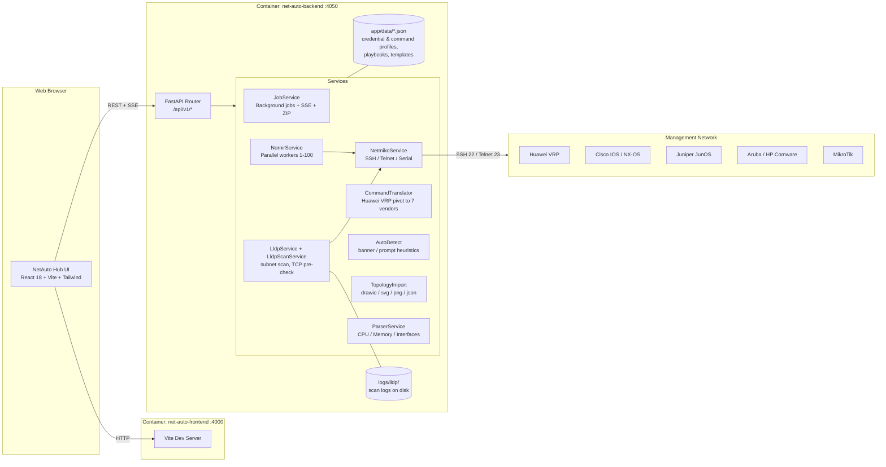

### 1.2 Network Deployment Topology

ตัวอย่างการวางระบบจริง: Server ที่รัน Docker ต้องเข้าถึง Management IP ของอุปกรณ์ได้ (SSH 22 / Telnet 23) ส่วนผู้ใช้เข้าผ่านเบราว์เซอร์อย่างเดียว

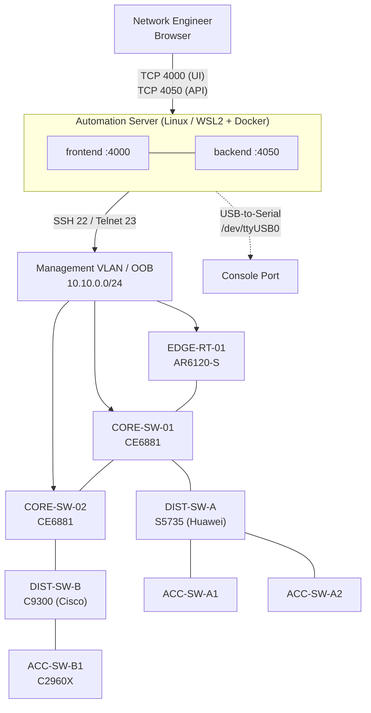

### 1.3 Flow ของงาน Fleet (Async Job)

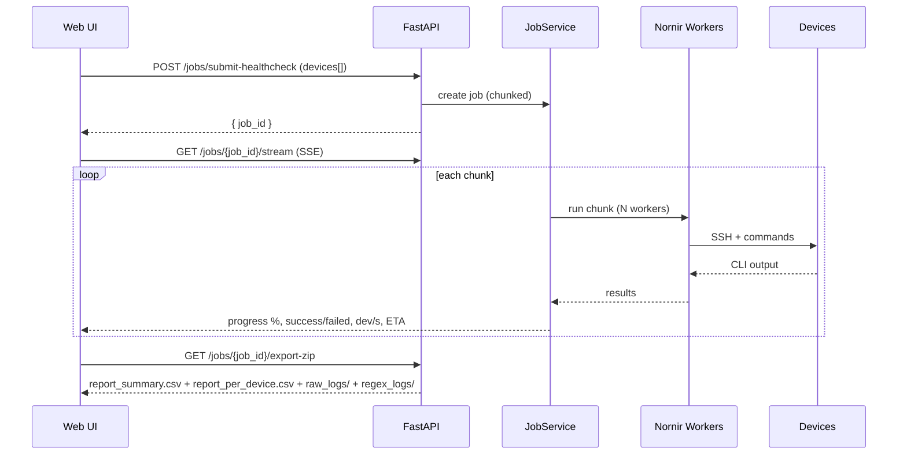

### 1.4 Flow ของ LLDP Subnet Scan

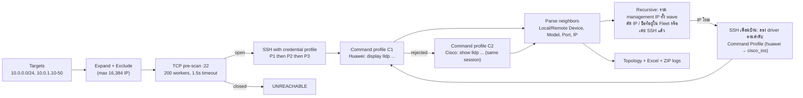

### 1.5 Flow ของ Topology: สร้าง → แก้ → export → เปิดกลับมาแก้ต่อ

ทุกทางเข้าจะกลายเป็น document เดียวกัน (devices, links + interface, flows, zones, notes) ที่ Topology Editor แก้ได้ และทุกไฟล์ที่ export ฝัง document นี้ไว้ จึงเปิดกลับมาแก้ต่อได้โดยไม่เสียอะไร

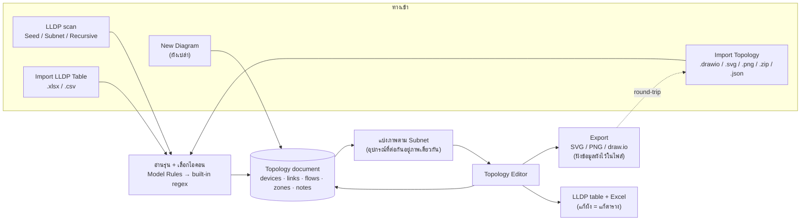

---

## 2. Key Features

### LLDP Discovery → Topology (จุดเด่น)

**ค้นหาอุปกรณ์**
- **Seed Devices** หรือ **Subnet Scan** (CIDR / range / IP เดี่ยว + exclude) รันเป็น background job, TCP pre-scan port 22 ก่อน SSH เพื่อข้าม IP ที่ไม่มีเครื่อง
- **Command Profile Priority** (C1, C2, C3 … เพิ่มได้) — ลองคำสั่งทีละ profile บน SSH session เดียว เช่น Huawei `display` ไม่ผ่านก็ใช้ Cisco `show` ต่อโดยไม่ login ซ้ำ สร้าง profile ของยี่ห้ออื่นเองได้จากหน้าเว็บ
- **Recursive discovery** ตาม LLDP management IP (max depth 1–10)
  - รอให้ครบทั้ง wave แล้วรวม IP ก่อน SSH — ตัดตัวที่อยู่ใน Fleet (เทียบทั้ง IP และชื่อ, ไม่สนโดเมน) และตัวที่เคย SSH แล้ว ไม่วนกลับ
  - เพื่อนบ้านที่ยังไม่รู้ยี่ห้อ ลอง login ด้วย driver ตามลำดับ Command Profile (`huawei` → `cisco_ios`) แทนการใช้ driver ของตัวต้นทาง
- Scan log เขียนลงดิสก์ทันทีต่อ host (`job.log`, `scan_result.csv`, `lldp_inventory.csv`, `hosts/*.log`) — ปิดเบราว์เซอร์ก็ไม่หาย
- ผลลัพธ์: **LLDP Inventory**, **Execution Summary**, **Topology** และ export **Excel** (`LLDP_Inventory`, `Execution_Summary`, `Raw_Logs`)

**สร้างผังได้ 4 ทาง** — ผลสแกน LLDP, **Import LLDP Table** (Excel / CSV ที่มีคอลัมน์ Local / Remote Device + Port พร้อมปุ่มดาวน์โหลด Template), **Import Topology** (`.drawio / .svg / .png / .zip / .json`) หรือ **New Diagram** วาดเองจากผังเปล่า

**Topology Editor**

| กลุ่ม | เครื่องมือ |
| :--- | :--- |
| วาด | Add device, **Connect** (ลากจากอุปกรณ์ไปอุปกรณ์แล้วเลือก interface ทั้งสองฝั่ง), **Traffic flow** (เส้นทางข้อมูลแบบเคลื่อนไหว หลายเส้นได้), **Zone** (Site / DMZ / VLAN / Rack), **Note** |
| แก้ | ดับเบิลคลิกอุปกรณ์เพื่อแก้ชื่อ / IP / รุ่น / ชนิด / interface ทุกเส้น, Delete, Undo / Redo |
| เลือกและจัดวาง | เลือกหลายตัว (Shift+ลากกรอบ, Shift+คลิก, Ctrl+A), ลากทั้งกลุ่ม, **Align** ซ้าย / กลาง / ขวา / บน / ล่าง, **Distribute** ระยะเท่ากัน, **จัดผังใหม่เฉพาะที่เลือก**, **เส้นไกด์** ตอนลากเมื่อตรงแนวกับตัวอื่น, Snap to grid |
| ทำซ้ำ | **Ctrl+D** ทำสำเนา, **Ctrl+C / Ctrl+V** — ลิงก์ที่ต่อกันภายในกลุ่มที่เลือกก๊อปมาด้วย |
| ดูผังใหญ่ | **Ctrl+F** ค้นหาอุปกรณ์ (ข้ามภาพได้), ปุ่มซูม / Fit selection, **โหมดเต็มจอ (F)**, ซ่อนอุปกรณ์บางชนิดจาก legend (ผลไปถึงไฟล์ที่ export ด้วย) |
| Layout | Hierarchical, Force, Saved positions และ **แบ่งภาพตาม Subnet** (อุปกรณ์ต่าง subnet ที่ต่อกันอยู่ภาพเดียวกัน) |

**ไอคอนตามรุ่นอุปกรณ์**
- อ่านรุ่นจากผล `display / show version` และ LLDP System description (Huawei `CE6881`, `S5735`, `AR6120`, Cisco `C2960X`, `C9300`, `ISR4331` …) ย่อ FQDN เป็น hostname
- 8 ชนิดอุปกรณ์: Router, Switch, Firewall, Server, Cloud / ISP, PC, Wireless AP, Unknown
- **Model Rules / Teach model** — รุ่นที่ระบบไม่รู้จัก (FortiGate, Aruba, Ruijie …) สอนได้จากหน้าเว็บ: เลือกข้อความตัวอย่าง ลากคลุมชื่อรุ่น เลือกไอคอน ระบบสร้าง regex ให้ แล้ว **Re-parse** ผลเดิมโดยไม่ต้อง SSH ใหม่
- **Model → Icon** แผงใต้ภาพบอกว่ารุ่นไหนใช้ไอคอนอะไร และมาจากไหน (กฎที่สอน / built-in / ตั้งในผัง)

**Export / Import**
- Export **SVG / PNG / draw.io** เฉพาะภาพที่เปิดอยู่ พร้อมชื่อ interface ปลายลิงก์ (เลือกได้) ทุกไฟล์ฝังข้อมูลผังไว้ เปิดกลับมาแก้ต่อได้ครบ
- แก้ผังแล้วตาราง LLDP และ Excel เปลี่ยนตาม

### Fleet & Inventory
- **Fleet Device Inventory** ใช้ร่วมกันทุกหน้า: เพิ่ม/ลบ/ค้นหา host, ตั้ง driver ทีละเครื่องหรือทั้งหมด
- **Import Fleet** จาก CSV / Excel / JSON / YAML / TXT (ตรวจ delimiter และ encoding อัตโนมัติ) + ดาวน์โหลดไฟล์ template
- **Auto Detect Device Type** รายเครื่องหรือทั้ง fleet จาก banner / prompt / `show version`
- **Credential Profiles** เก็บ username/password หลายชุดเรียงลำดับ Priority (P1 → P2 → P3) ระบบลองทีละชุดจนเข้าได้ และบันทึกว่าเข้าด้วยชุดไหน
- **Nornir Workers** ปรับ concurrency 1–100 ได้จาก UI (sync กับ backend)
- **SSH Legacy Compatibility** เปิด KEX/HostKey รุ่นเก่า (`diffie-hellman-group1/14-sha1`, `ssh-rsa`) ให้ต่อ Switch รุ่นเก่าได้

### Health Check
- 6 preset: Standard, Interfaces, Transceiver (SFP), Hardware/Environment, Routing & ARP, System Logs + Custom Playbook
- **Saved Command Profiles** (Playbooks) สร้าง/แก้ไข/ลบได้ พร้อม regex filter รายคำสั่ง
- Parser สรุป CPU %, Memory %, จำนวน Interface ที่ Up

### Troubleshoot & CLI
- รันหลายคำสั่งพร้อมกันทั้ง fleet พร้อม **regex filter ต่อคำสั่ง**
- Ping / Traceroute จากตัวอุปกรณ์, ค้นหา Log Buffer (Syslog) ด้วย keyword
- Terminal output มี copy และ **mask password/secret อัตโนมัติ**

### Deploy Config
- Script Editor + Verified Template Snippets (Huawei / Cisco / Aruba / Juniper) + Interactive GUI Config Builder
- **Pre-check → Backup running-config → Push → Save → Post-check → Rollback commands** ในงานเดียว
- Backup config ทั้ง fleet, ดูผลรายเครื่องและ History

### Async Jobs & Reports
- ส่งงาน fleet ได้ `job_id` ทันที, ติดตามผ่าน **SSE**: %, completed/success/failed, dev/s, ETA
- Pagination + filter + search ผลลัพธ์, **Cancel** กลางทาง
- Export ZIP: `report_summary.csv`, `report_per_device.csv`, `raw_logs/`, `regex_logs/`

---

## 3. Tech Stack

| Layer | เครื่องมือ | ใช้ทำอะไร |
| :--- | :--- | :--- |
| Backend | **Python 3.10**, **FastAPI**, Uvicorn, Pydantic v2 | REST API, SSE, validation |
| Network Automation | **Netmiko**, **Paramiko**, **Nornir** (+ nornir-netmiko) | SSH/Telnet ไปอุปกรณ์, รันขนาน |
| Serial Console | pyserial | ต่อสาย console USB-to-Serial |
| Templating | Jinja2 | Config templates |
| Reports | openpyxl, csv, zipfile | Excel / CSV / ZIP |
| Frontend | **React 18**, **Vite 5**, **TailwindCSS 3**, axios, lucide-react | Web UI, Topology editor (SVG) |
| Diagram export | SVG / PNG / draw.io XML (เขียนเอง ไม่ใช้ lib) | Export + round-trip import |
| Infra | **Docker**, **Docker Compose** | รัน frontend + backend |
| Testing | unittest + mock (`test_fleet_simulation.py`) | จำลอง fleet 1,000–10,000 เครื่อง |

---

## 4. Getting Started

### 4.1 Prerequisites

| รายการ | ขั้นต่ำ | แนะนำ |
| :--- | :--- | :--- |
| OS | Linux, macOS, Windows + WSL2 | Ubuntu 22.04+ / WSL2 |
| CPU / RAM | 2 vCPU / 4 GB | 4–8 vCPU / 8–16 GB (fleet หลักพัน+) |
| Disk | 2 GB | 10 GB+ (เก็บ scan logs) |
| Docker | Docker Engine 24+ และ Docker Compose v2 | Docker Desktop (Windows/macOS) |
| รันแบบไม่ใช้ Docker | Python 3.10+, Node.js 20+ | — |
| Network | Server ต้องเข้าถึง Management IP ของอุปกรณ์ทาง TCP 22 (SSH) หรือ 23 (Telnet) | แยก Management VLAN / OOB |
| Browser | Chrome / Edge / Firefox รุ่นปัจจุบัน | — |

### 4.2 Clone

```bash
git clone <repository-url> deploy-config
cd deploy-config
```

### 4.3 Setup Environment

```bash
cp .env.example .env
```

แก้ค่าใน `.env` อย่างน้อย:
- `SECRET_KEY` — เปลี่ยนเป็นค่าสุ่ม
- `VITE_API_BASE_URL` — ถ้าเปิดเว็บจากเครื่องอื่น ให้ใส่ IP ของ server แทน `localhost` เช่น `http://192.168.10.5:4050`
- `ALLOWED_ORIGINS` — ใส่ URL ที่ใช้เปิดหน้าเว็บ

ดูตัวแปรทั้งหมดที่ [หัวข้อ 9](#9-configuration-env)

### 4.4 Run ด้วย Docker Compose (แนะนำ)

```bash
docker compose up --build -d     # build + start
docker compose ps                # ตรวจสถานะ
docker compose logs -f backend   # ดู log backend
```

| Service | URL |
| :--- | :--- |
| Web UI | http://localhost:4000 |
| API Swagger | http://localhost:4050/docs |
| API ReDoc | http://localhost:4050/redoc |

ตรวจว่า backend ขึ้นแล้ว:

```bash
$ curl -s http://localhost:4050/
{"status":"online","service":"Network Automation & Diagnostics Web API","version":"1.0.0","docs_url":"/docs"}
```

หมายเหตุ:
- `docker-compose.yml` mount `./backend/app` และ `./frontend` เข้า container — แก้โค้ดแล้ว reload อัตโนมัติ
- scan logs ของ LLDP เก็บที่ `./backend/logs` บนเครื่อง host
- backend รันแบบ `privileged: true` เพื่อให้ใช้สาย console (`/dev/ttyUSB0`) ได้ ถ้าไม่ใช้ serial สามารถเอาออกได้

ปิดระบบ:

```bash
docker compose down
```

### 4.5 Run แบบ Local Development (ไม่ใช้ Docker)

**Backend**

```bash
cd backend
python3 -m venv .venv
source .venv/bin/activate          # Windows: .venv\Scripts\activate
pip install -r requirements.txt
uvicorn app.main:app --host 0.0.0.0 --port 4050 --reload
```

**Frontend** (terminal ใหม่)

```bash
cd frontend
npm install
npm run dev                        # http://localhost:4000
```

---

## 5. Usage — วิธีใช้งานแต่ละหน้า

### 5.1 เตรียม Fleet (ทุกหน้าใช้ร่วมกัน)
1. **Profiles** → สร้าง Credential Profile ใส่ username/password เรียง P1, P2, P3 แล้วตั้งเป็น Default
2. เพิ่มอุปกรณ์ด้วย **Add Row** หรือ **Import Fleet** (ไฟล์ตาม [หัวข้อ 11](#11-inventory-import-formats))
3. เลือก driver ด้วย **Set All Vendors → Apply Driver** หรือกด **Detect Types** ให้ระบบหาเอง
4. ปรับ **Nornir Workers** ตามสเปก server

### 5.2 Health Check
เลือก preset (เช่น Standard Overall Check) หรือ Saved Command Profile → **Run Fleet Suite** → ดู progress ใน Job Monitor → Export ZIP

### 5.3 Troubleshoot & CLI
พิมพ์คำสั่ง (ใส่ regex filter ได้) → **Add Another Command** ถ้ามีหลายคำสั่ง → **Run Across Fleet**
ด้านล่างมี Ping / Traceroute และค้นหา Syslog

### 5.4 Deploy Config
1. เขียนคำสั่งใน **Configuration Commands Script** หรือเลือกจาก Template Snippets
2. เปิด Pre-check / Post-check / Backup / Save ตามต้องการ
3. Deploy → ดูผลใน **Deployment Results & Analytics** (มี rollback commands ให้) และ **History**

### 5.5 LLDP Discovery
1. เลือกโหมด **Seed Devices** (ใช้ fleet ด้านบน) หรือ **Subnet Scan** (ใส่ `10.10.0.0/24`, `10.10.1.10-50`)
2. เรียง **Command Profile Priority** (C1 Huawei, C2 Cisco) กด **Add priority** เพิ่มลำดับ หรือ **Manage** เพื่อสร้าง profile ของยี่ห้ออื่น
3. เปิด TCP Pre-Check / Recursive ตามต้องการ → Start
   - Recursive ใช้ Credential Profile เดียวกับอุปกรณ์ต้นทาง ถ้าเพื่อนบ้านใช้บัญชีอื่น ให้เพิ่มเป็นอีก priority ในโปรไฟล์
4. ดูแท็บ **LLDP Inventory**, **Execution Summary** (กดขยายแถวเพื่อดู log การ SSH และ raw output), **Topology**
5. Export Excel / ZIP logs หรือ Topology เป็น SVG / PNG / draw.io

ไม่มีอุปกรณ์ให้สแกน? ใช้ **Import LLDP Table** (กด **Template** เพื่อโหลดไฟล์ Excel ตัวอย่าง), **Import Topology** หรือ **New Diagram** ได้เลย

**รุ่นขึ้นเป็น Unknown?** กด **Teach model** บนแถบแจ้งเตือน (หรือ **Model Rules** ข้าง Command Profile Priority)
1. เลือกข้อความตัวอย่างจากผลสแกน (ผล version หรือ LLDP System description)
2. ลากเมาส์คลุมชื่อรุ่น เช่น `FortiGate-100F` — ระบบสร้าง regex ที่ครอบคลุมทั้งตระกูล (`FortiGate-` + ตัวเลข) ให้เอง
3. เลือกไอคอน → **Save & apply to result** ผลเดิมจะถูกอ่านใหม่ทันทีโดยไม่ต้อง SSH

### 5.6 Topology Editor

เปิดแท็บ **Topology** → กด **Edit** (กด **Full screen** หรือ `F` เพื่อใช้ทั้งจอ)

| เครื่องมือ | คีย์ | วิธีใช้ |
| :--- | :---: | :--- |
| Select / move | `V` | ลากย้าย, ดับเบิลคลิกอุปกรณ์เพื่อแก้ข้อมูลและ interface |
| Add device | `N` | คลิกพื้นที่ว่าง แล้วกรอกชื่อ / IP / รุ่น / ชนิด |
| Connect | `C` | ลากจากอุปกรณ์หนึ่งไปอีกตัว แล้วเลือก interface ทั้งสองฝั่ง |
| Traffic flow | `T` | คลิกอุปกรณ์ตามเส้นทาง, `Enter` หรือดับเบิลคลิกตัวสุดท้ายเพื่อจบ, `Backspace` ถอยหนึ่ง hop |
| Zone | `Z` | ลากกรอบ, ลากมุมขวาล่างเพื่อปรับขนาด |
| Note | `A` | คลิกตำแหน่งแล้วพิมพ์ข้อความ (หลายบรรทัดได้) |
| Delete | `X` | คลิกอุปกรณ์ / ลิงก์ / flow / zone / note ที่จะลบ |

| คีย์ลัด / ท่า | ผล |
| :--- | :--- |
| `Shift` + ลากบนพื้นที่ว่าง | เลือกทุกอุปกรณ์ในกรอบ |
| `Shift` + คลิก, `Ctrl+A` | เพิ่ม / เอาออกทีละตัว, เลือกทั้งภาพ |
| ลากตัวใดตัวหนึ่งในกลุ่ม | ย้ายทั้งกลุ่ม |
| แถบเครื่องมือด้านล่าง (เลือก ≥ 2) | Align 6 แบบ, Distribute แนวนอน / แนวตั้ง, จัดผังใหม่เฉพาะที่เลือก, Duplicate, Copy, Delete |
| `Ctrl+D`, `Ctrl+C` / `Ctrl+V` | ทำสำเนา / คัดลอก-วาง (ลิงก์ภายในกลุ่มมาด้วย, IP ไม่ถูกก๊อป) |
| `Ctrl+F` | เปิด / ปิดช่องค้นหา (ชื่อ, IP, รุ่น) — กดผลลัพธ์เพื่อเลื่อนไปหา |
| `F` | เข้า / ออกโหมดเต็มจอ |
| `Ctrl+Z` / `Ctrl+Y`, `Del`, `Esc` | Undo / Redo, ลบสิ่งที่เลือก, ยกเลิก |
| คลิกชิปชนิดอุปกรณ์ใน legend | ซ่อน / แสดงชนิดนั้น (ไฟล์ที่ export ก็ซ่อนตาม) |

- ลากอุปกรณ์แล้วมี **เส้นไกด์สีชมพู** เมื่อตรงแนวกับตัวอื่น — ตำแหน่งจะ snap เข้าแนวให้
- วางไฟล์ `.drawio / .svg / .png / .json` ลงบนผังเพื่อรวมเข้ากับผังที่เปิดอยู่ (ชื่ออุปกรณ์ซ้ำ = อุปกรณ์เดียวกัน)
- ลิงก์ที่วาดเองเป็น **เส้นสีเขียวอมฟ้า**, เส้นประ = LLDP เห็นจากฝั่งเดียว

---

## 6. Demo / Output

> ภาพทั้งหมดถ่ายจากระบบที่รันจริงด้วย Docker Compose (headless Chrome 1600×1000) — ข้อมูล topology ในภาพเป็นชุดตัวอย่าง

### 6.1 Health Check — Fleet Inventory + Credential Profile + Presets
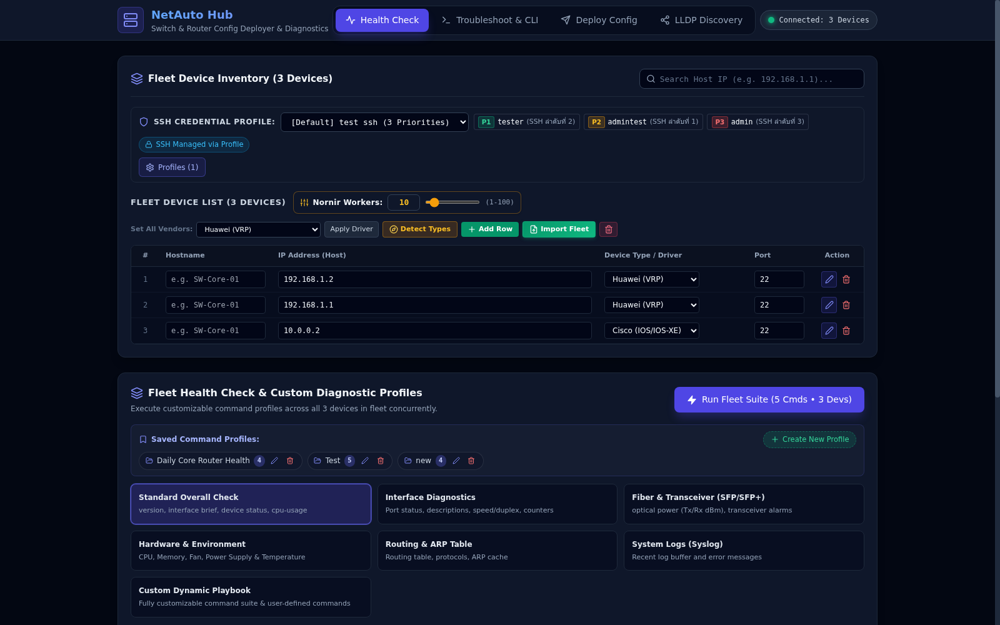

### 6.2 Troubleshoot & CLI — รันคำสั่งทั้ง fleet พร้อม regex filter
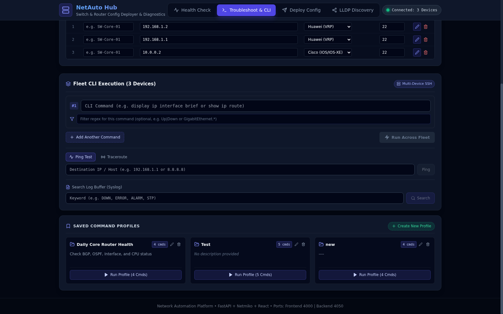

### 6.3 Deploy Config — Script editor + Template snippets
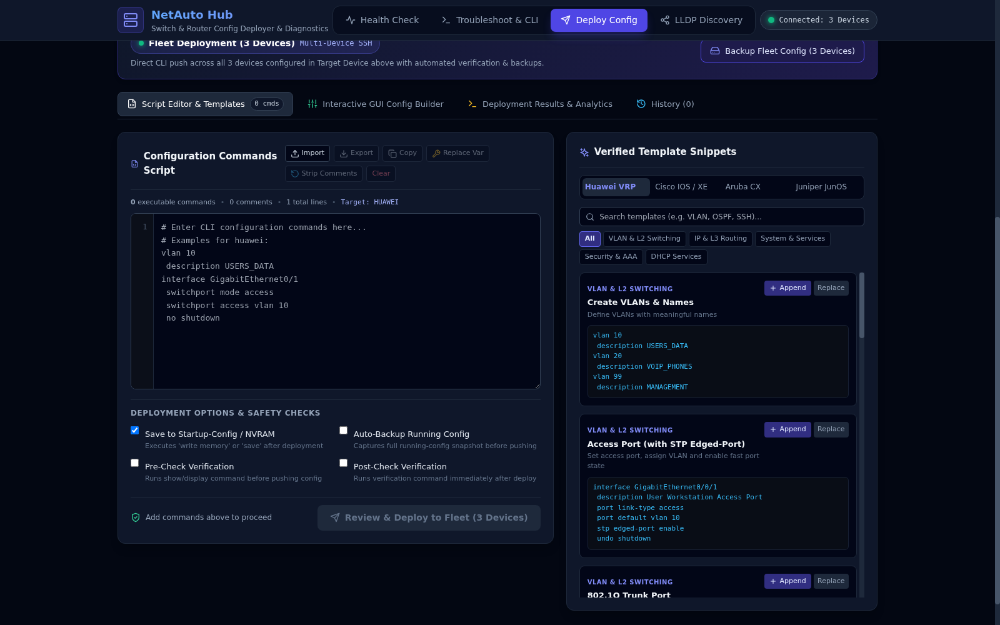

### 6.4 LLDP Discovery — Seed devices + Command profile priority
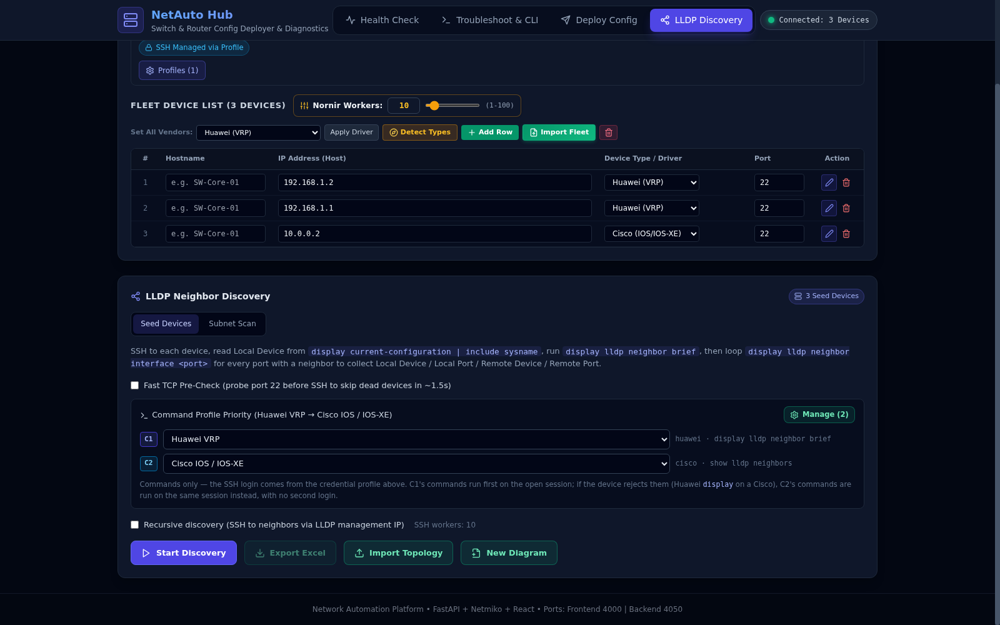

### 6.5 LLDP Topology — วาดจาก LLDP (Huawei + Cisco ผสม)
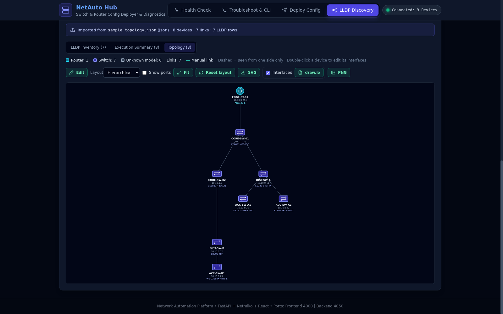

### 6.6 Topology Editor — โหมดเต็มจอ, Zone, Traffic flow, Note และเลือกหลายตัว
ผัง campus ตัวอย่าง ([`docs/samples/campus_topology.json`](docs/samples/campus_topology.json)): firewall, core คู่, Huawei + Cisco, AP และ server แบ่ง zone ตามอาคาร มี traffic flow 2 เส้น เลือก access switch 3 ตัวอยู่ แถบด้านล่างคือเครื่องมือ align / distribute / duplicate


### 6.7 ค้นหาอุปกรณ์ในผัง (Ctrl+F)
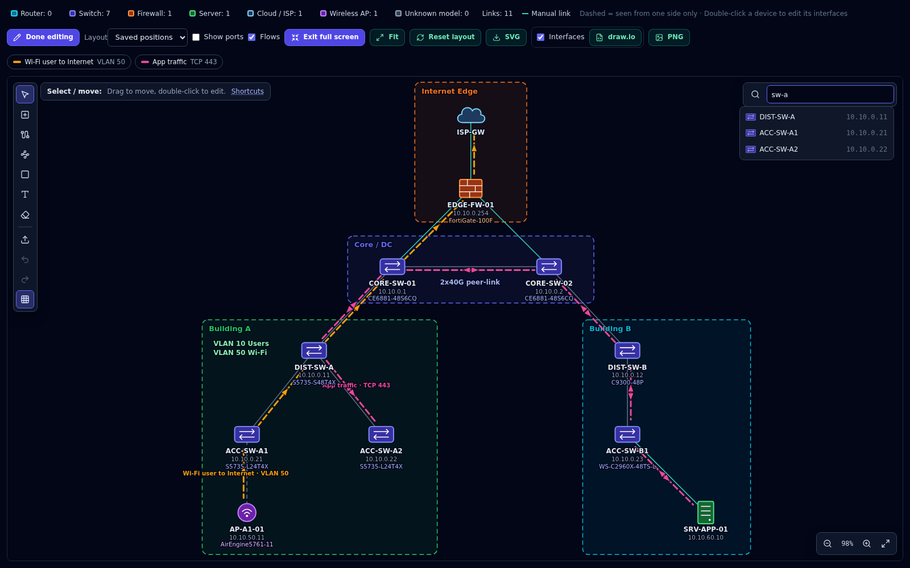

### 6.8 Model → Icon — รุ่นไหนใช้ไอคอนอะไร และมาจากไหน
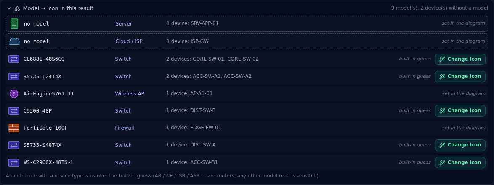

### 6.9 Terminal: Fleet Simulation Test (1,000 / 10,000 / Cancel)

```text
$ docker exec net-auto-backend python test_fleet_simulation.py

######################################################################
  NETWORK AUTOMATION PLATFORM - BACKGROUND FLEET AUTOMATION SUITE
######################################################################
======================================================================
  [TEST 1] Scale Simulation: 1,000 Devices (Troubleshoot & Diagnostics)
======================================================================
Generated 1,000 devices across 5 network vendor platforms.
Job Submitted Successfully! Job ID: 631560e6-e723-4782-89e5-abc6e19c6c4b
Initial Status: pending, Total Devices: 1,000
Monitoring Real-Time Progress Stream:
  [##############################] 100.0% | Completed: 1000/1000 | Success:  900 | Failed: 100 | Speed:   328 dev/s | Time: 3.05s
 Job Completed in 3.06s!
Verifying Paginated Results API (Page 1 - 50 items):
  - Total Items: 1,000
  - Total Pages: 20 (50 items/page)
  - Failed Devices Filter: 100 items found (All with success=False)
  - Search '10.0.1.' Filter: 256 matching devices found
 [TEST 1 PASSED] 1,000 Devices Chunking & Pagination Verified!
======================================================================
  [TEST 2] Massive Scale Simulation: 10,000 Devices (Config Deployment)
======================================================================
  [##############################] 100.0% | Completed: 10000/10000 | Speed:   482 dev/s | Time: 20.77s
 10,000 Devices Config Deployed in 20.8s!
 [TEST 2 PASSED] 10,000 Devices Chunking & Memory Performance Verified!
======================================================================
  [TEST 3] Mid-Execution Cancellation Simulation: 5,000 Devices
======================================================================
Final Job Status: 'cancelled'
Completed Devices Before Halt: 30 / 5,000
 [TEST 3 PASSED] Job Cancellation Successfully Aborted Remaining Chunks!
======================================================================
  ALL 3 FLEET SIMULATION TESTS PASSED SUCCESSFULLY! (100% OPERATIONAL)
======================================================================
```

> การทดสอบนี้ mock การเชื่อมต่อ SSH เพื่อวัด job engine (chunking, SSE, pagination, cancel) ไม่ได้ต่ออุปกรณ์จริง

### 6.10 Terminal: เรียก API โดยตรง

```bash
# แปลคำสั่ง Huawei เป็นทุกยี่ห้อ
$ curl -s -X POST localhost:4050/api/v1/playbooks/auto-translate \
    -H 'content-type: application/json' -d '{"commands":["display interface brief"]}'
{"source_vendor":"huawei","commands":["display interface brief"],
 "translations":{"huawei":["display interface brief"],"cisco_ios":["show ip interface brief"],
 "juniper_junos":["show interfaces terse"],"cisco_nxos":["show interface status"],
 "aruba_os":["show interface brief"],"hp_comware":["display interface brief"],
 "mikrotik_routeros":["/interface print brief"]}}

# ดูจำนวน IP ก่อนสั่ง subnet scan
$ curl -s -X POST localhost:4050/api/v1/lldp/scan-subnet/preview \
    -H 'content-type: application/json' \
    -d '{"targets":["10.0.0.0/24","10.0.1.10-50"],"exclude":["10.0.0.1"]}'
{"count":294,"first":"10.0.0.2","last":"10.0.1.50"}

# ดู/ตั้งค่า Nornir workers
$ curl -s localhost:4050/api/v1/system/nornir-workers
{"num_workers":10,"min_workers":1,"max_workers":100,"default_workers":10}
```

### 6.11 ไฟล์ผลลัพธ์

**Fleet job ZIP** (`GET /jobs/{id}/export-zip`)
```text
report_summary.csv        # Job ID, start/end, total, success, failed, duration, success rate
report_per_device.csv     # hostname_import, sysname_device, ip, result, detail
raw_logs/{host}_{name}.txt
regex_logs/{host}_{name}.txt
```

**LLDP scan logs** (`backend/logs/lldp/<timestamp>_<job>/` และ `GET /lldp/scan-subnet/{id}/export-zip`)
```text
job.log                   # timeline ของทั้ง job
scan_result.csv           # ip, depth, tcp_open, status, sysname, model, credential, command_profile, neighbors, time_s, detail
lldp_inventory.csv        # Local Device, Local Model, Local IP, Local Port, Remote Device, Remote Model, Remote Port, Remote IP
hosts/<ip>_<sysname>.log  # execution log + raw CLI
summary.json, topology.json, lldp_report.xlsx
```

สถานะใน `scan_result.csv`: `SUCCESS`, `NO_LLDP`, `DUPLICATE`, `AUTH_FAILED`, `FAILED`, `UNREACHABLE`

---

## 7. Project Structure

```text
deploy-config/
├── .env.example                 # ตัวอย่าง config
├── docker-compose.yml           # frontend + backend
├── generate_devices.py          # สร้าง CSV อุปกรณ์จำลอง
├── devices_10000.csv            # ชุดทดสอบ 10,000 เครื่อง
├── docs/screenshots/            # ภาพประกอบ README
├── docs/samples/campus_topology.json   # ผังตัวอย่างสำหรับ Import Topology
│
├── backend/
│   ├── Dockerfile               # python:3.10-slim + ping/traceroute
│   ├── requirements.txt
│   ├── test_fleet_simulation.py # simulation 1k/10k/cancel
│   └── app/
│       ├── main.py              # FastAPI app + routers
│       ├── core/config.py       # Settings จาก env
│       ├── data/                # JSON storage
│       │   ├── credential_profiles.json
│       │   ├── command_profiles.json   # LLDP command profiles (Huawei, Cisco)
│       │   ├── model_rules.json        # กฎอ่านรุ่น / ไอคอนที่สอนจากหน้าเว็บ
│       │   ├── playbooks.json
│       │   └── templates.json
│       ├── schemas/             # Pydantic models
│       ├── services/
│       │   ├── autodetect_service.py
│       │   ├── command_profile_service.py
│       │   ├── command_translator.py
│       │   ├── inventory_parser.py
│       │   ├── job_service.py
│       │   ├── lldp_service.py          # collect + parse LLDP, recursive + driver sweep, Excel
│       │   ├── lldp_scan_service.py     # subnet scan job + disk logs
│       │   ├── lldp_table_import.py     # Import LLDP Table (.xlsx / .csv)
│       │   ├── model_rule_service.py    # Model Rules: regex รุ่น + ชนิดอุปกรณ์
│       │   ├── netmiko_service.py
│       │   ├── nornir_service.py
│       │   ├── parser_service.py
│       │   ├── playbook_service.py
│       │   ├── profile_service.py
│       │   ├── ssh_compat.py            # legacy KEX / host key
│       │   ├── template_service.py
│       │   └── topology_import_service.py
│       └── api/endpoints/
│           ├── command_profiles.py  deploy.py  devices.py  healthcheck.py
│           ├── jobs.py  lldp.py  model_rules.py  playbooks.py  profiles.py
│           └── system.py  templates.py  troubleshoot.py
│
└── frontend/
    ├── Dockerfile / Dockerfile.dev / nginx.conf
    ├── package.json / vite.config.js / tailwind.config.js
    └── src/
        ├── App.jsx                  # tabs + shared fleet state
        ├── services/api.js          # axios client + SSE
        ├── components/
        │   ├── Navbar.jsx  DeviceForm.jsx  TerminalOutput.jsx  AsyncJobModal.jsx
        │   ├── NornirWorkersControl.jsx  TcpWorkersControl.jsx
        │   ├── LldpTopology.jsx      # topology view + editor (tools, multi-select, find, full screen)
        │   ├── TopologyDialogs.jsx   # device / interface / flow / zone / note dialogs
        │   ├── topologyModel.js      # topology document: devices, links, flows, zones, notes
        │   ├── topologyLayout.js     # hierarchical / force layout
        │   ├── topologyGroups.js     # แบ่งภาพตาม subnet
        │   ├── topologyIcons.jsx     # router, switch, firewall, server, cloud, pc, wireless
        │   ├── topologyExport.js     # SVG / PNG / draw.io export (ฝังข้อมูลผัง)
        │   ├── ModelRulesModal.jsx   # Teach model wizard
        │   ├── modelRuleBuilders.js  # สร้าง regex จากข้อความที่เลือก
        │   └── ModelIconLegend.jsx   # แผง Model → Icon
        └── pages/
            ├── HealthCheckPage.jsx  TroubleshootPage.jsx
            ├── DeployConfigPage.jsx  LldpDiscoveryPage.jsx
            └── TemplateStudioPage.jsx   # ยังไม่ได้ผูกกับ Navbar
```

---

## 8. REST API Reference

Base URL: `http://localhost:4050/api/v1` — ดูรายละเอียด request/response ได้ที่ `/docs`

### Devices — `/devices`
| Method | Path | คำอธิบาย |
| :--- | :--- | :--- |
| GET | `/types` | รายการ driver ที่รองรับ |
| GET | `/serial-ports` | serial port ที่มีในเครื่อง |
| POST | `/test-connection` | ทดสอบเชื่อมต่อ |
| POST | `/detect-type` | auto-detect 1 เครื่อง |
| POST | `/detect-fleet` | auto-detect ทั้ง fleet |
| POST | `/import` | upload ไฟล์ inventory |
| GET | `/templates/{format_name}` | ดาวน์โหลด template (`csv`, `xlsx`, `json`, `yaml`) |

### Credential Profiles — `/profiles`
`GET ""`, `GET /{id}`, `POST ""`, `PUT /{id}`, `DELETE /{id}`, `POST /{id}/default`

### Health Check — `/healthcheck`
| Method | Path | คำอธิบาย |
| :--- | :--- | :--- |
| GET | `/presets` | preset ทั้ง 6 หมวดพร้อมคำสั่ง |
| POST | `/run` | รัน 1 เครื่อง |
| POST | `/run-batch` | รันหลายเครื่อง (sync) |

### Troubleshoot — `/troubleshoot`
`POST /execute-command`, `POST /execute-batch`

### Deploy — `/deploy`
| Method | Path | คำอธิบาย |
| :--- | :--- | :--- |
| POST | `/push` | push config 1 เครื่อง |
| POST | `/push-advanced` | pre-check, backup, push, save, post-check, rollback |
| POST | `/push-batch` | push หลายเครื่อง |
| POST | `/backup` / `/backup-batch` | backup running-config |

### Async Jobs — `/jobs`
| Method | Path | คำอธิบาย |
| :--- | :--- | :--- |
| POST | `/submit-troubleshoot` · `/submit-deploy` · `/submit-backup` · `/submit-healthcheck` | ส่งงาน fleet ได้ `job_id` |
| GET | `/{job_id}/status` | สถานะ |
| GET | `/{job_id}/results` | ผลแบบแบ่งหน้า (filter/search) |
| GET | `/{job_id}/results/all` | ผลทั้งหมด |
| GET | `/{job_id}/stream` | SSE progress |
| POST | `/{job_id}/cancel` | ยกเลิก |
| GET | `/{job_id}/export-zip` | ZIP report |

### LLDP — `/lldp`
| Method | Path | คำอธิบาย |
| :--- | :--- | :--- |
| POST | `/discover` | LLDP จาก seed devices |
| POST | `/scan-subnet/preview` | นับ IP ก่อน scan |
| POST | `/scan-subnet` | เริ่ม subnet scan job |
| GET | `/scan-subnet/{job_id}` | สถานะ (+ `include_report`, `log_lines`) |
| POST | `/scan-subnet/{job_id}/cancel` | ยกเลิก |
| GET | `/scan-subnet/{job_id}/export-zip` | ZIP ของ log directory |
| POST | `/import-topology` | import `.drawio/.svg/.png/.zip/.json` หรือตาราง LLDP `.xlsx/.csv` (≤ 50 MB) |
| GET | `/import-template` | ไฟล์ Excel ตัวอย่างสำหรับ Import LLDP Table |
| POST | `/reparse` | อ่านรุ่น / ชนิดอุปกรณ์ของผลเดิมใหม่ด้วย Model Rules ปัจจุบัน (ไม่ SSH) |
| POST | `/export-excel` | สร้าง `lldp_detailed_report_*.xlsx` |

### LLDP Command Profiles — `/command-profiles`
`GET ""`, `GET /{id}`, `POST ""`, `PUT /{id}`, `DELETE /{id}`, `POST /reorder`

### Model Rules — `/model-rules`
`GET ""`, `POST ""`, `PUT /{id}`, `DELETE /{id}`, `POST /reorder`, `POST /test` (ลองกฎกับข้อความตัวอย่างก่อนบันทึก)

### Playbooks / Templates / System
| Method | Path | คำอธิบาย |
| :--- | :--- | :--- |
| GET/POST/PUT/DELETE | `/playbooks`, `/playbooks/{id}` | CRUD command profiles |
| POST | `/playbooks/auto-translate` | แปลคำสั่ง Huawei → vendor อื่น |
| GET/POST/PUT/DELETE | `/templates`, `/templates/{id}` | CRUD Jinja2 templates |
| POST | `/templates/execute` | render + รัน template |
| GET/POST | `/system/nornir-workers` | ดู/ตั้ง workers (1–100) |

---

## 9. Configuration (.env)

| ตัวแปร | ค่าเริ่มต้น | คำอธิบาย |
| :--- | :--- | :--- |
| `FRONTEND_PORT` | `4000` | port ของ Web UI |
| `BACKEND_PORT` | `4050` | port ของ API |
| `BACKEND_HOST` | `0.0.0.0` | bind address |
| `VITE_API_BASE_URL` | `http://localhost:4050` | URL ที่เบราว์เซอร์ใช้เรียก API |
| `ALLOWED_ORIGINS` | `http://localhost:4000,http://127.0.0.1:4000` | CORS origins |
| `DEFAULT_DEVICE_TYPE` | `huawei` (`.env.example` ตั้ง `cisco_ios`) | driver เริ่มต้น |
| `DEFAULT_SSH_PORT` | `22` | |
| `DEFAULT_TELNET_PORT` | `23` | |
| `DEFAULT_TIMEOUT` | `30` | timeout เชื่อมต่อ (วินาที) |
| `DEFAULT_NUM_WORKERS` | `10` | Nornir workers เริ่มต้น |
| `GLOBAL_DELAY_FACTOR` | `1` | Netmiko delay factor (เพิ่มถ้าอุปกรณ์ตอบช้า) |
| `LLDP_LOG_DIR` | `logs/lldp` | ที่เก็บ scan logs |
| `LLDP_SCAN_MAX_IPS` | `16384` | จำนวน IP สูงสุดต่อ subnet scan |
| `SECRET_KEY` | — | เปลี่ยนก่อนใช้งานจริง |
| `ENVIRONMENT` | `development` | `development` / `production` |

---

## 10. Supported Vendors & Command Matrix

### 10.1 Drivers

| Driver (`device_type`) | ชื่อใน UI | Protocol | ตัวอย่างอุปกรณ์ |
| :--- | :--- | :--- | :--- |
| `autodetect` | Auto Detect (Recommended) | SSH | ตรวจหาเอง |
| `huawei` | Huawei VRP (SSH) | SSH 22 | CloudEngine, S-Series, AR, NE, USG |
| `huawei_telnet` | Huawei VRP (Telnet) | Telnet 23 | Huawei รุ่นเก่า |
| `cisco_ios` | Cisco IOS / IOS-XE (SSH) | SSH 22 | Catalyst 2960/3850/9200/9300, ISR, ASR |
| `cisco_ios_telnet` | Cisco IOS (Telnet) | Telnet 23 | lab / legacy |
| `cisco_nxos` | Cisco NX-OS | SSH 22 | Nexus 3000–9000 |
| `aruba_os` | Aruba OS-CX / ProCurve | SSH 22 | Aruba CX 6100–8320, 2530, 2930 |
| `juniper_junos` | Juniper JunOS | SSH 22 | EX, QFX, SRX |
| `hp_comware` | HP / H3C Comware | SSH 22 | HPE FlexNetwork 5130/5510/5900, H3C |
| `mikrotik_routeros` | MikroTik RouterOS | SSH 22 | CRS, CCR |
| `linux` | Linux / Cumulus | SSH 22 | Ubuntu, Cumulus, SONiC |
| `generic_termserver_telnet` | Generic Telnet | Telnet | lab switch ไม่มี auth |
| `generic_termserver` | Generic SSH / Paramiko | SSH | อุปกรณ์อื่น ๆ |

> LLDP Discovery ปัจจุบันมี command profile สำหรับ **Huawei VRP** และ **Cisco IOS / IOS-XE / NX-OS** — เพิ่ม vendor อื่นได้จากปุ่ม **Manage** (ต้องมี parser รองรับ)

### 10.2 Command Equivalents (Huawei VRP เป็น pivot)

| หมวด | Huawei VRP | Cisco IOS | Juniper JunOS | HPE Aruba | HP Comware | MikroTik |
| :--- | :--- | :--- | :--- | :--- | :--- | :--- |
| Version | `display version` | `show version` | `show version` | `show version` | `display version` | `/system resource print` |
| Interface | `display interface brief` | `show ip interface brief` | `show interfaces terse` | `show interface brief` | `display interface brief` | `/interface print brief` |
| Running config | `display current-configuration` | `show running-config` | `show configuration` | `show running-config` | `display current-configuration` | `/export` |
| Routing | `display ip routing-table` | `show ip route` | `show route` | `show ip route` | `display ip routing-table` | `/ip route print` |
| ARP | `display arp all` | `show ip arp` | `show arp` | `show arp` | `display arp all` | `/ip arp print` |
| MAC table | `display mac-address` | `show mac address-table` | `show ethernet-switching table` | `show mac-address` | `display mac-address` | `/interface bridge host print` |
| CPU | `display cpu-usage` | `show processes cpu sorted` | `show chassis routing-engine` | `show cpu` | `display cpu-usage` | `/system resource print` |
| Link aggregation | `display eth-trunk` | `show etherchannel summary` | `show lacp interfaces` | `show lacp` | `display link-aggregation verbose` | `/interface bonding print` |
| VLAN | `display vlan` | `show vlan brief` | `show vlans` | `show vlans` | `display vlan all` | `/interface vlan print` |
| LLDP | `display lldp neighbor brief` | `show lldp neighbors` | `show lldp neighbors` | `show lldp info remote-device` | `display lldp neighbor list` | `/ip neighbor print` |
| Transceiver | `display transceiver diagnosis interface` | `show interfaces transceiver` | `show interfaces diagnostics optics` | `show interface transceiver` | `display transceiver diagnosis interface` | `/interface ethernet monitor [find] once` |
| Logs | `display logbuffer` | `show logging` | `show log messages` | `show logging` | `display logbuffer` | `/log print` |

ตัวแปลยังรองรับ parameter ต่อท้าย (เช่น `display arp 192.168.1.1` → `show ip arp 192.168.1.1`), ชื่อ interface (`Eth-Trunk 10` ↔ `Port-channel 10` ↔ `ae10` ↔ `Bridge-Aggregation 10`) และตัวย่อ (`dis ver`, `sh ip int br`, `sh run`)

---

## 11. Inventory Import Formats

รองรับ CSV, Excel (`.xlsx/.xls`), JSON, YAML, TXT — ใส่ `hostname` + `ip` หรือ `ip` อย่างเดียวก็ได้ เลือกโหมด **Replace** หรือ **Append** ได้

**CSV** (`,` `;` หรือ tab)
```csv
hostname,ip
SW-Core-HQ-001,192.168.1.1
RT-Edge-DC1-003,10.10.0.1
```

**JSON**
```json
[
  { "hostname": "SW-Core-HQ-001", "ip": "192.168.1.1" },
  "10.10.0.1"
]
```

**YAML**
```yaml
- hostname: SW-Core-HQ-001
  ip: 192.168.1.1
```

**TXT** — IP บรรทัดละเครื่อง
```text
192.168.1.1
10.10.0.1
```

**Excel** — แถวแรกเป็นหัวคอลัมน์ `hostname | ip`

---

## 12. เตรียมอุปกรณ์จริงให้พร้อมใช้งาน

เปิด SSH, สร้าง user และ LLDP บนอุปกรณ์ (ระบบสั่งปิด pager ให้เองทุกครั้ง)

**Huawei VRP**
```text
aaa
 local-user netauto password irreversible-cipher <password>
 local-user netauto service-type ssh
 local-user netauto privilege level 15
#
stelnet server enable
ssh user netauto authentication-type password
ssh user netauto service-type stelnet
#
user-interface vty 0 4
 authentication-mode aaa
 protocol inbound ssh
#
lldp enable
```

**Cisco IOS / IOS-XE**
```text
username netauto privilege 15 secret <password>
ip domain-name lab.local
crypto key generate rsa modulus 2048
ip ssh version 2
line vty 0 4
 transport input ssh
 login local
!
lldp run
```

**Juniper JunOS**
```text
set system login user netauto class super-user authentication plain-text-password
set system services ssh protocol-version v2
set protocols lldp interface all
commit
```

---

## 13. Testing & Mock Data

**สร้างรายชื่ออุปกรณ์จำลอง** — hostname รูปแบบ `SW-Core-HQ-00142`, IP private ไม่ซ้ำ ไม่ใช้ `.0` / `.255`
```bash
python3 generate_devices.py 1000 devices_1000.csv
python3 generate_devices.py 10000 devices_10000.csv
```

**Fleet simulation** (mock SSH, ทดสอบ chunking / progress / pagination / cancel)
```bash
docker exec net-auto-backend python test_fleet_simulation.py
# หรือ local
cd backend && python test_fleet_simulation.py
```

**Auto-detect simulation**
```bash
cd backend && python -m app.test_autodetect_simulation
```

---

## 14. Performance Tuning

แนวทางเลือกจำนวน Nornir workers:

| Server | Workers |
| :--- | :--- |
| 2 vCPU / 2–4 GB | 10–20 |
| 4–8 vCPU / 8–16 GB | 30–50 (แนะนำ) |
| 16+ vCPU / 32+ GB | 80–100 |

LLDP subnet scan: TCP pre-scan ใช้ได้ถึง 1,000 workers (default 200) และ SSH workers แยกจาก TCP workers

สำหรับงานหลักหมื่นเครื่อง ปรับ kernel บน host:
```bash
sudo sysctl -w fs.file-max=2097152
sudo sysctl -w net.core.somaxconn=65535
sudo sysctl -w net.ipv4.tcp_max_syn_backlog=65535
# /etc/security/limits.conf
# * soft nofile 65535
# * hard nofile 65535
```

---

## 15. Security Notes

- Password / secret / pre-shared-key ถูก mask เป็น `******` ใน terminal และ log
- ตรวจ sysname จริงของอุปกรณ์เทียบกับ hostname ที่ import เพื่อกัน deploy ผิดเครื่อง
- Backup running-config ก่อน deploy และสร้าง rollback commands ให้
- `.env`, `logs/`, `backend/logs/` อยู่ใน `.gitignore`
- **ข้อควรระวัง**:
  - Credential profiles เก็บเป็น plain text ใน `backend/app/data/credential_profiles.json` — อย่า commit รหัสจริง และจำกัดสิทธิ์เข้าถึง server
  - ยังไม่มีระบบ login ของเว็บ และ CORS เปิด `*` — ควรรันใน network ภายในหรือหลัง reverse proxy ที่มี auth
  - `ssh_compat.py` เปิด algorithm รุ่นเก่า (SHA1) เพื่อรองรับอุปกรณ์เก่า

---

## 16. Troubleshooting & FAQ

**หน้าเว็บขึ้นแต่เรียก API ไม่ได้ / Backend disconnected**
ตรวจ `docker compose ps` และ `VITE_API_BASE_URL` — ถ้าเปิดจากเครื่องอื่นต้องเป็น IP ของ server ไม่ใช่ `localhost` แก้แล้ว `docker compose up -d --force-recreate frontend`

**Import CSV แล้วไม่พบ IP**
ตรวจหัวคอลัมน์ `ip` หรือ `hostname,ip` ถ้าไม่มีหัว ระบบจะหาค่าที่เป็น IP ในคอลัมน์แรก

**Authentication failed / Timeout**
ตรวจ ACL/Firewall ระหว่าง server กับอุปกรณ์ (TCP 22/23), ลองเพิ่ม `DEFAULT_TIMEOUT=45` และ `GLOBAL_DELAY_FACTOR=2` และเพิ่ม credential สำรองใน profile

**LLDP scan ได้สถานะ `NO_LLDP`**
login ได้แต่ไม่มี neighbor — ตรวจว่าเปิด LLDP แล้ว (`lldp enable` / `lldp run`) และลำดับ command profile ถูก vendor

**Output ค้างที่ `--More--`**
ระบบส่ง `screen-length 0 temporary` / `terminal length 0` ให้อัตโนมัติ ถ้ายังค้างให้ตรวจสิทธิ์ user ว่ารันคำสั่งนี้ได้

**Topology ว่างหลัง import**
ไฟล์ต้อง export จาก LLDP Discovery (มี metadata `lldp-topology`) หรือเป็น draw.io ที่มี label hostname/IP บน shape

**แก้ backend แล้วไม่เปลี่ยน**
Uvicorn `--reload` ปกติจะโหลดเอง ถ้าไม่ขึ้น: `docker restart net-auto-backend`
